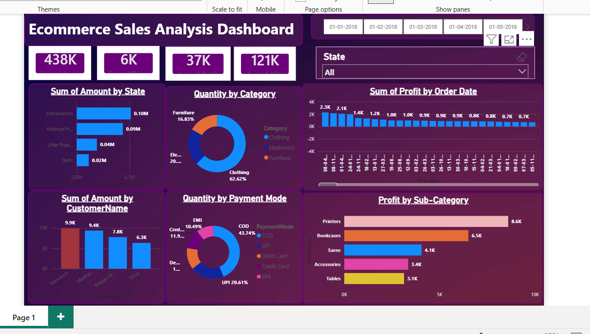

# Swiggy Power BI Dashboard

## Project Overview

This project is an interactive Power BI dashboard created to analyze Swiggy restaurant data and generate useful business insights.

## Tools Used

- Power BI Desktop
- Power Query
- DAX
- Data Cleaning
- Data Visualization

## Dataset

The dataset contains restaurant-related information such as:

- Restaurant Name
- Location
- Food Type
- Rating
- Price
- Delivery Information

## Dashboard Features

The dashboard provides analysis of:

- Total Restaurants
- Average Rating
- Average Price
- Restaurant Distribution
- Food Categories
- Restaurant Ratings
- Location-wise Analysis
- Interactive Filters and Slicers

## Data Preparation

The data was cleaned and transformed using Power Query before creating the dashboard.

## DAX

DAX measures were created to calculate important KPIs and analytical metrics.

## Dashboard Preview

## Power BI Project File

[Download PBIX File](Swiggy_Dashboard.pbix)

## Live Dashboard

[View Power BI Dashboard](YOUR_POWER_BI_LINK)

## Conclusion

The dashboard provides an interactive way to explore E-Commerce sales data and identify patterns based on sales, products, customers, regions, and other buisness metrics. 
